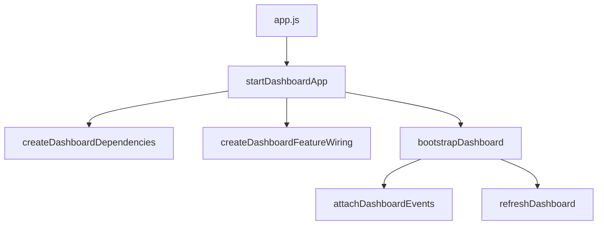

# Frontend Architecture

Last updated: 2026-06-08

This frontend uses a modular static-ESM architecture with business-oriented module names.

## Goals

- Keep `app.js` as a tiny entrypoint.
- Separate business workflows from platform utilities.
- Make each module easy to evolve in isolation.

## High-level structure

- `app.js`: startup entrypoint only.
- `js/business/`: business workflows and composition logic.
- `js/platform/`: shared infrastructure utilities (API, UI helpers, state, event wiring).

## Composition flow



## Business modules

- `js/business/dashboard-composition.js`
: top-level coordinator that connects dependencies, features, and bootstrap.
- `js/business/dashboard-dependencies.js`
: constructs app dependencies (elements, runtime, loaders, map, pagination).
- `js/business/dashboard-feature-wiring.js`
: assembles refresh/actions/interactions and event attachment.
- `js/business/dashboard-bootstrap.js`
: startup lifecycle (`loadSavedConfig`, bind events, first refresh).
- `js/business/dashboard-event-wiring.js`
: translates feature handlers into the event binder contract.
- `js/business/dashboard-refresh-controller.js`
: refresh use-case orchestration.
- `js/business/dashboard-actions.js`
: submit/admin action handlers.
- `js/business/dashboard-interactions.js`
: layer mode, auto-refresh, CSV export interactions.
- `js/business/dashboard-loaders.js`
: API-backed loader operations and rendering handoff.
- `js/business/dashboard-pagination.js`
: paging reset and next/prev handlers.
- `js/business/dashboard-map-controller.js`
: shared map render function and map dependencies.
- `js/business/dashboard-loader-adapters.js`
: consistent loader adapter bundles for each feature area.

## Platform modules

- `js/platform/api-client.js`: HTTP wrapper.
- `js/platform/dashboard-elements.js`: DOM registry.
- `js/platform/dashboard-runtime.js`: runtime wrappers for status/toast/format/copy/download.
- `js/platform/event-binder.js`: centralized DOM event binding.
- `js/platform/pagination-controls.js`: generic pager logic.
- `js/platform/metrics-view-model.js`: dashboard metric card composition.
- `js/platform/runtime-state.js`: default app state and map helpers.
- `js/platform/session-config.js`: local storage config persistence.
- `js/platform/ui-helpers.js`: generic UI utility primitives.

## Dependency direction

Keep dependencies one-way:

1. `app.js` depends on `business`.
2. `business` depends on `platform` and business peers.
3. `platform` should not depend on `business`.

## Extension guidelines

1. Put new domain behavior in `js/business/` first.
2. Put cross-cutting reusable helpers in `js/platform/`.
3. Add new wiring in `dashboard-feature-wiring.js` instead of `app.js`.
4. Keep `dashboard-composition.js` declarative and thin.

## Module ownership matrix

| Change request | First module to edit | Why |
| --- | --- | --- |
| Add a new API-powered dashboard panel | `js/business/dashboard-loaders.js` | New read path and render handoff start in loaders. |
| Add a new row action in Exports/API Keys | `js/business/dashboard-actions.js` | Row-level operational actions are centralized there. |
| Add a new filter/search behavior | `js/business/dashboard-interactions.js` | UI interaction and local filtering triggers live there. |
| Change refresh sequence or parallelism | `js/business/dashboard-refresh-controller.js` | Refresh controller defines orchestration payload. |
| Change startup behavior | `js/business/dashboard-bootstrap.js` | Bootstrap owns init order (load config, bind, first refresh). |
| Change event binding contract | `js/business/dashboard-event-wiring.js` | Handler-to-binder mapping is isolated there. |
| Add shared dependencies to app graph | `js/business/dashboard-dependencies.js` | Dependency construction is centralized there. |
| Reorganize cross-feature wiring | `js/business/dashboard-feature-wiring.js` | Feature assembly and attach hooks are built there. |
| Update map render dependencies | `js/business/dashboard-map-controller.js` | Map deps and render delegate are shared there. |
| Add/adjust pager behavior | `js/business/dashboard-pagination.js` | Paging handlers and reset behavior are owned there. |
| Add reusable UI utility | `js/platform/ui-helpers.js` | Platform-level UI primitives belong there. |
| Add reusable request handling behavior | `js/platform/api-client.js` | HTTP transport and error wrapping is centralized there. |

## How to add a new business feature

1. Define API contract first.
    Add or update the API call in the relevant service module under `js/business/services/`.
2. Add loader support when data is read-heavy.
    Extend `js/business/dashboard-loaders.js` and surface the loader through `js/business/dashboard-loader-adapters.js`.
3. Add action or interaction handlers.
    Use `js/business/dashboard-actions.js` for submit/admin operations and `js/business/dashboard-interactions.js` for local UI interactions.
4. Wire feature dependencies.
    Register required dependencies in `js/business/dashboard-feature-wiring.js`.
5. Update dependency graph only if needed.
    If new cross-cutting dependencies are required, add them in `js/business/dashboard-dependencies.js`.
6. Attach events through the event wiring module.
    Map new handlers in `js/business/dashboard-event-wiring.js` rather than editing binder internals.
7. Verify startup and refresh paths.
    Confirm the feature is included in bootstrap/refresh behavior through `js/business/dashboard-bootstrap.js` and `js/business/dashboard-refresh-controller.js` when applicable.
8. Update docs.
    Add a short note to `ARCHITECTURE.md` and `README.md` when the feature changes architecture responsibilities or user-visible behavior.

## Troubleshooting guide

| Symptom | First place to debug | What to check |
| --- | --- | --- |
| Dashboard loads but cards/lists stay empty | `js/business/dashboard-loaders.js` | Confirm loader function runs, API call resolves, and render function receives expected payload shape. |
| Refresh button does nothing | `js/business/dashboard-refresh-controller.js` | Verify `refreshDashboard` is wired and orchestration receives loader dependencies. |
| Initial page load does not trigger data fetch | `js/business/dashboard-bootstrap.js` | Check bootstrap order: config load, event attach, initial refresh call. |
| Button click has no effect | `js/business/dashboard-event-wiring.js` | Confirm handler is mapped in wiring and expected element selector exists in DOM. |
| Submit/admin action returns no UI update | `js/business/dashboard-actions.js` | Verify action handler awaits service call and then triggers relevant loader refresh. |
| Filter/search UI changes but list does not update | `js/business/dashboard-interactions.js` | Check interaction handler updates local state and triggers render path. |
| Pagination next/prev stuck | `js/business/dashboard-pagination.js` | Validate offset/limit math and returned-count gating logic. |
| Map does not update after compare/selection | `js/business/dashboard-map-controller.js` | Ensure `renderMap` gets latest compare results + focused ZIP and correct map deps. |
| API calls fail globally | `js/platform/api-client.js` | Inspect base URL, API key headers, response status handling, and error parsing. |
| Config seems ignored after reload | `js/platform/session-config.js` | Verify save/load keys and checkbox-driven persistence behavior. |

## Release checklist

Use this checklist before handing off a frontend build.

1. Startup and connectivity
    Confirm app bootstraps, config is restored (if enabled), and initial refresh completes without console errors.
2. Core dashboard smoke
    Validate metrics, map, ZIP summary, compare board, exports list, audit list, and API key list all render with live API data.
3. Key permission paths
    Test with demo and admin keys to ensure restricted actions fail gracefully and admin actions succeed.
4. Export operations
    Create an export, process pending exports, and verify row actions (process/retry/fail/download/copy) behave correctly.
5. Pagination and filters
    Verify next/prev behavior, returned-count gating, and filter/search updates for exports and audit/activity views.
6. Auto-refresh behavior
    Enable auto-refresh, confirm periodic refreshes run, then disable and confirm timer stops.
7. API key lifecycle
    Create key, rotate key, revoke key, and validate list refresh plus status/toast feedback.
8. CSV utilities and map interactions
    Export visible CSVs (exports/activity), switch map layers, and select ZIP cards to confirm map + summary sync.
9. Persistence sanity
    Toggle remember-config and verify expected save/load behavior after reload.
10. Documentation and sync
    Ensure `README.md` and `ARCHITECTURE.md` reflect the latest module responsibilities and are synced to delivery location.
11. Governance changelog consistency
    For process/governance documentation updates, record the change using the `Governance update template` in `CHANGELOG.md`.

Sync command quick copy:

```bash
cp -f README.md ARCHITECTURE.md CHANGELOG.md HANDOFF.md '/mnt/c/D drive/2026/Monetize/frontend/' && ls -la '/mnt/c/D drive/2026/Monetize/frontend'
```

## Definition of done

A frontend feature slice is considered done when all criteria below are true:

1. Business ownership is clear.
    The feature has a primary business module and follows dependency direction rules.
2. Wiring is explicit.
    New handlers/loaders are connected through existing composition and feature wiring modules.
3. User behavior is verified.
    Relevant smoke paths from the release checklist pass for the changed feature area.
4. Error handling is acceptable.
    Failure states show actionable UI feedback (empty states, status pill, or toasts) instead of silent failures.
5. No diagnostics regressions.
    Workspace error scan reports no new errors in changed files.
6. Documentation is current.
    `ARCHITECTURE.md` and `README.md` are updated when responsibilities or user-visible behavior changed.
7. Delivery mirror is updated.
    Latest frontend files are synced to the Windows delivery path and presence is verified.

## Feature PR template

Use this template for consistent slice handoff notes.

```md
## Scope
- What changed:
- Why it changed:

## Modules touched
- Business:
- Platform:
- Docs:

## Validation
- Error scan result:
- Manual smoke paths checked:

## Delivery sync
- Windows mirror path:
- Files synced:
- Presence verified: yes/no

## Risks / follow-ups
- Known gaps:
- Next recommended slice:
```

## Glossary

- Slice: one incremental, self-contained change set delivered end-to-end (edit, validate, sync).
- Composition root: top-level module that assembles dependencies and feature wiring (`dashboard-composition.js`).
- Feature wiring: module that connects controllers/actions/interactions and exposes attach/refresh hooks (`dashboard-feature-wiring.js`).
- Loader: business function that fetches data and triggers corresponding render updates (`dashboard-loaders.js`).
- Loader adapter: grouped loader references prepared for specific consumers (refresh/actions/interactions/pagination) (`dashboard-loader-adapters.js`).
- Runtime: shared platform wrapper for API calls, status/toasts, formatting, and utility behaviors (`dashboard-runtime.js`).
- Delivery mirror: synced Windows destination used for handoff verification (`C:\D drive\2026\Monetize\frontend`).

## Session state workflow

Use this lifecycle for every contributor handoff:

1. Session start
    Set `Session status` to `active` in `HANDOFF.md`, update `Current owner/session`, initialize `Current session snapshot`, and review open items.
2. In-session updates
    Keep `Current session snapshot`, validation, and delivery sync notes current in `HANDOFF.md`.
3. Session close
    Complete the README close checklist, finalize `Current session snapshot`, fill `HANDOFF.md` -> `Closeout evidence` (including governance-template logging status) and closeout attribution fields, mark `Closeout attribution check` and `Governance template evidence check` in `HANDOFF.md` section 3, update `Last updated`, then set `Session status` to `closed`.
